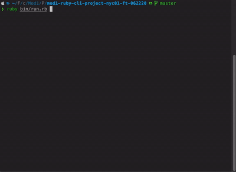

# The Commuter

The Commuter is a CLI tool for viewing live arrival times at any NYC MTA subway station.

## Demo

## Installation

### Prerequisites

- Ruby >= 3.3.0
- Command line interface

### Setup

1. `git clone` or manually download the repository.
2. `bundle install` to install dependencies.
3. `rake db:migrate` to initialize a local copy of my database model on your computer.
4. `rake db:seed` to populate your database with NYC MTA subway station information.

> [!IMPORTANT]
> `rake` commands must be executed from the root directory of the project.

### Quickstart

`ruby bin/run.rb` to run the application.
